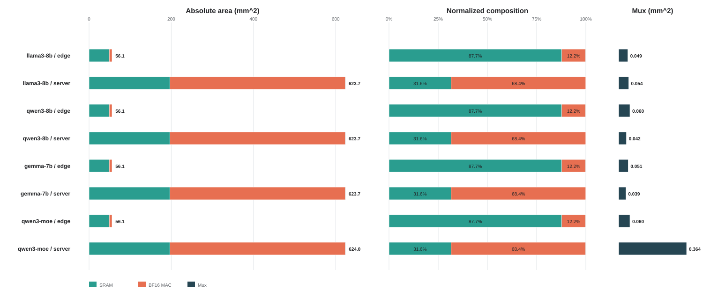

# DAP area breakdown

Only the three characterized primitives are included: SRAM banks, paired BF16 MACs, and 2:1 mux equivalents.

| Model | Config | SRAM (mm^2) | MAC (mm^2) | Mux (mm^2) | Total (mm^2) | SRAM (%) | MAC (%) | Mux (%) |
|---|---|---:|---:|---:|---:|---:|---:|---:|
| llama3-8b | edge | 49.226496 | 6.849427 | 0.049421 | 56.125344 | 87.708 | 12.204 | 0.088 |
| llama3-8b | server | 196.905984 | 426.740070 | 0.053834 | 623.699888 | 31.571 | 68.421 | 0.009 |
| qwen3-8b | edge | 49.226496 | 6.849427 | 0.060453 | 56.136376 | 87.691 | 12.201 | 0.108 |
| qwen3-8b | server | 196.905984 | 426.740070 | 0.041920 | 623.687974 | 31.571 | 68.422 | 0.007 |
| gemma-7b | edge | 49.226496 | 6.849427 | 0.051186 | 56.127109 | 87.705 | 12.203 | 0.091 |
| gemma-7b | server | 196.905984 | 426.740070 | 0.038610 | 623.684665 | 31.571 | 68.422 | 0.006 |
| qwen3-moe | edge | 49.226496 | 6.849427 | 0.060453 | 56.136376 | 87.691 | 12.201 | 0.108 |
| qwen3-moe | server | 196.905984 | 426.740070 | 0.364481 | 624.010536 | 31.555 | 68.387 | 0.058 |

Area constants:

- SRAM bank: `192291 um^2`
- BF16 MAC: `3243.1 um^2`
- 2:1 mux: `13.7894 um^2`

