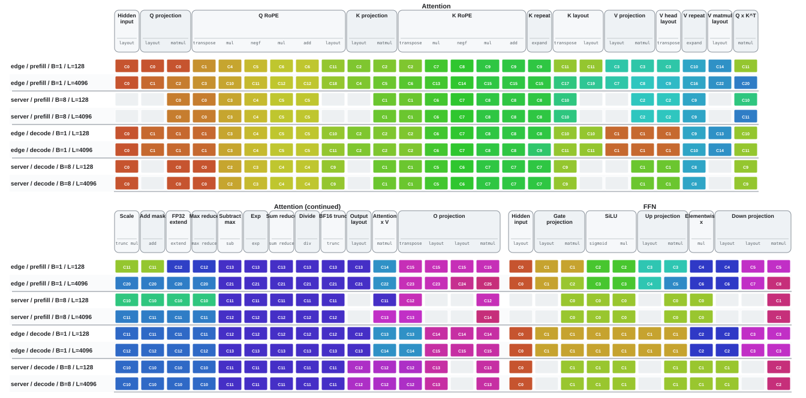

# llama3-8b cluster analysis

Cluster membership is reconstructed by matching normalized `linalg.generic` operations from scheduled cluster functions to the original generic MLIR. Cluster IDs are canonicalized by their earliest source operation for visualization only.

| Layer | Mode | Target | Batch | Length | Clusterable ops | Clusters | Cut edges | Ambiguous | Unmatched |
|---|---|---|---:|---:|---:|---:|---:|---:|---:|
| attention | decode | edge | 1 | 128 | 40 | 15 | 22/47 | 20 | 0 |
| attention | decode | edge | 1 | 4096 | 40 | 16 | 23/47 | 14 | 0 |
| attention | decode | server | 8 | 128 | 34 | 14 | 21/41 | 14 | 0 |
| attention | decode | server | 8 | 4096 | 34 | 14 | 21/41 | 10 | 0 |
| attention | prefill | edge | 1 | 128 | 40 | 16 | 22/47 | 20 | 0 |
| attention | prefill | edge | 1 | 4096 | 40 | 26 | 32/47 | 16 | 0 |
| attention | prefill | server | 8 | 128 | 30 | 13 | 17/35 | 10 | 0 |
| attention | prefill | server | 8 | 4096 | 30 | 15 | 19/35 | 8 | 0 |
| ffn | decode | edge | 1 | 128 | 11 | 4 | 5/12 | 0 | 0 |
| ffn | decode | edge | 1 | 4096 | 11 | 4 | 5/12 | 0 | 0 |
| ffn | decode | server | 8 | 128 | 8 | 3 | 3/9 | 0 | 0 |
| ffn | decode | server | 8 | 4096 | 8 | 3 | 3/9 | 0 | 0 |
| ffn | prefill | edge | 1 | 128 | 11 | 6 | 7/12 | 6 | 0 |
| ffn | prefill | edge | 1 | 4096 | 11 | 9 | 10/12 | 7 | 0 |
| ffn | prefill | server | 8 | 128 | 6 | 2 | 1/6 | 0 | 0 |
| ffn | prefill | server | 8 | 4096 | 6 | 2 | 1/6 | 0 | 0 |

## Key results

- Attention prefill is the most length-sensitive case: edge grows from 16 at L=128 to 26 at L=4096, while server grows from 13 at L=128 to 15 at L=4096.
- FFN prefill grows from 6 at L=128 to 9 at L=4096 on edge and remains 2 across L=128-4096 on server.
- Decode is largely length-insensitive: attention is 15 at L=128 to 16 at L=4096 on edge and 14 across L=128-4096 on server; FFN is 4 across L=128-4096 and 3 across L=128-4096, respectively.
- Edge uses batch 1 while server uses batch 8 in these files. Their comparison represents the complete deployment configurations, not an architecture-only controlled experiment.
- The edge and server generic DAGs also contain different operation counts. Use within-configuration length trends for causal claims; absolute edge/server cluster counts are descriptive rather than a controlled fusion comparison.

## Interpretation

- Fewer clusters indicate that the scheduler can keep larger operation groups together on the selected architecture.
- The cut-edge ratio is a topology-oriented proxy for materialized communication; use `external_access_sum` from `cluster_runs.csv` for the scheduler's volume-aware metric.
- `ambiguous_matches` counts structurally identical operations that lack persistent source IDs. They are mapped deterministically, but symmetric branches may be exchanged.
- Constant-broadcast generics are shown as gray infrastructure nodes because the scheduler passes their scalar constants as cluster arguments instead of cloning them.
- Any nonzero unmatched count is a validation failure and should be investigated before using that row in a paper.

## Figures

The matrix aligns generic operations across configurations. Colors and `C#` labels are local to one row; repeated color within that row denotes operations assigned to the same cluster. Rounded header outlines identify the named model operation containing adjacent generics.

Editable source: [`generic_cluster_matrix.drawio`](generic_cluster_matrix.drawio)
